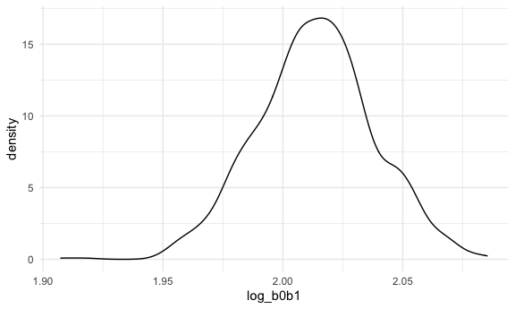

p8105 hw6
================

## Problem 1

To obtain a distribution for $\hat{r}^2$, we’ll follow basically the
same procedure we used for regression coefficients: draw bootstrap
samples; the a model to each; extract the value I’m concerned with; and
summarize. Here, we’ll use `modelr::bootstrap` to draw the samples and
`broom::glance` to produce `r.squared` values.

``` r
weather_df = 
  rnoaa::meteo_pull_monitors(
    c("USW00094728"),
    var = c("PRCP", "TMIN", "TMAX"), 
    date_min = "2017-01-01",
    date_max = "2017-12-31") %>%
  mutate(
    name = recode(id, USW00094728 = "CentralPark_NY"),
    tmin = tmin / 10,
    tmax = tmax / 10) %>%
  select(name, id, everything())
```

``` r
weather_df %>% 
  modelr::bootstrap(n = 1000) %>% 
  mutate(
    models = map(strap, ~lm(tmax ~ tmin, data = .x) ),
    results = map(models, broom::glance)) %>% 
  select(-strap, -models) %>% 
  unnest(results) %>% 
  ggplot(aes(x = r.squared)) + geom_density()
```


In this example, the $\hat{r}^2$ value is high, and the upper bound at 1
may be a cause for the generally skewed shape of the distribution. If we
wanted to construct a confidence interval for $R^2$, we could take the
2.5% and 97.5% quantiles of the estimates across bootstrap samples.
However, because the shape isn’t symmetric, using the mean +/- 1.96
times the standard error probably wouldn’t work well.

We can produce a distribution for $\log(\beta_0 * \beta1)$ using a
similar approach, with a bit more wrangling before we make our plot.

``` r
weather_df %>% 
  modelr::bootstrap(n = 1000) %>% 
  mutate(
    models = map(strap, ~lm(tmax ~ tmin, data = .x) ),
    results = map(models, broom::tidy)) %>% 
  select(-strap, -models) %>% 
  unnest(results) %>% 
  select(id = `.id`, term, estimate) %>% 
  pivot_wider(
    names_from = term, 
    values_from = estimate) %>% 
  rename(beta0 = `(Intercept)`, beta1 = tmin) %>% 
  mutate(log_b0b1 = log(beta0 * beta1)) %>% 
  ggplot(aes(x = log_b0b1)) + geom_density()
```



As with $r^2$, this distribution is somewhat skewed and has some
outliers.

The point of this is not to say you should always use the bootstrap –
it’s possible to establish “large sample” distributions for strange
parameters / values / summaries in a lot of cases, and those are great
to have. But it is helpful to know that there’s a way to do inference
even in tough cases.

## Problem 2

### Data Cleaning

``` r
homicide_df =
  read_csv("./data/homicide-data.csv", na = c("", "Unknown", "NA")) %>% 
  janitor::clean_names() %>% 
  mutate(
    city_state = str_c(city, ", ", state),
    victim_age = as.numeric(victim_age),
    status = if_else(disposition == "Closed without arrest" | disposition == "Open/No arrest", "unresolved", "resolved"),
    status_numeric = if_else(status == "unresolved", 0, 1)
  ) %>% 
  filter(city_state != "Dallas, TX" & city_state != "Phoenix, AZ" & city_state != "Kansas City, MO" & city_state != "Tusla, AL") %>% 
  filter(victim_race == "White" | victim_race == "Black")
```

### Logistic Regression Model

``` r
Baltimore_reg =
  homicide_df %>% 
  filter(city_state == "Baltimore, MD") %>% 
  glm(status_numeric ~ victim_race + victim_age + victim_sex, family = binomial(link='logit') , data = .)

Baltimore_reg %>% 
  broom::tidy()
```

    ## # A tibble: 4 × 5
    ##   term             estimate std.error statistic  p.value
    ##   <chr>               <dbl>     <dbl>     <dbl>    <dbl>
    ## 1 (Intercept)       0.310     0.171        1.81 7.04e- 2
    ## 2 victim_raceWhite  0.842     0.175        4.82 1.45e- 6
    ## 3 victim_age       -0.00673   0.00332     -2.02 4.30e- 2
    ## 4 victim_sexMale   -0.854     0.138       -6.18 6.26e-10

### Adjusted odds ratio

The adjusted odds ratio of solving homicides for male victim compared to
female victim is 0.426. We are 95% confident that the true odds ratio
will fall into (0.325, 0.558).

``` r
Baltimore_reg %>% 
  broom::tidy() %>% 
  filter(term == "victim_sexMale") %>%
  mutate(
    OR = exp(estimate),
    lower_CI = exp(estimate - 1.96 * std.error),
    upper_CI = exp(estimate + 1.96 * std.error)
  ) %>% 
  select(term, OR, lower_CI, upper_CI) %>% 
  knitr::kable(digits = 3)
```

| term           |    OR | lower_CI | upper_CI |
|:---------------|------:|---------:|---------:|
| victim_sexMale | 0.426 |    0.325 |    0.558 |

### Regression for Each City ?

homicide_df %\>% drop_na(victim_age, victim_race, victim_sex) %\>%
nest(df = -city_state) %\>% mutate( models = map(.x = df,
\~glm(status_numeric \~ victim_race + victim_age + victim_sex, data =
.x, family = binomial())), results = map(models, broom::tidy) ) %\>%
mutate(OR = exp(estimate), lower_CI = exp(estimate - (1.96 \*
std.error)), upper_CI = exp(estimate + (1.96 \* std.error))) %\>%
select(city_state, term, OR, lower_CI, upper_CI)

## Problem 3

There’s no na in the data set. I converted baby sex, malform, female and
male races to factor variables.

``` r
birthwt_df =
  read_csv("./data/birthweight.csv") %>%
  janitor::clean_names() %>% 
  mutate(
    frace = as.factor(frace),
    mrace = as.factor(mrace),
    babysex = as.factor(babysex),
    malform = as.factor(malform)) 
  
  
map(birthwt_df, ~sum(is.na(.)))
```

### Model proposal

I would like to propose a model using baby’s head circumference,
mother’s weight gain during pregnancy, and baby’s length. Below are data
visualizations for bwt and the variables I’m choosing. There isn’t
extreme skewness below and I do not need to do transformation to the
variables.

``` r
birthwt_df %>% 
  ggplot(aes(x = bwt)) + 
  geom_density()
```


``` r
birthwt_df %>% 
  ggplot(aes(x = bhead)) + 
  geom_density()
```


``` r
birthwt_df %>% 
  ggplot(aes(x = blength)) + 
  geom_density()
```


``` r
birthwt_df %>% 
  ggplot(aes(x = wtgain)) + 
  geom_density()
```


### Model 1

``` r
model_1 = lm(bwt ~ bhead + blength + wtgain, data = birthwt_df)
```

The residual against fitted value plot indicate that the residuals are
approximately constant around residual = 0 line.

``` r
modelr::add_residuals(birthwt_df, model_1) %>% 
  ggplot(aes(x = bwt, y = resid)) +
  geom_point(alpha = .3)
```


### Add two models

``` r
model_2 = lm(bwt ~ blength + gaweeks, data = birthwt_df)
model_3 = lm(bwt ~ babysex + bhead + blength + babysex*bhead + babysex*blength + blength*bhead + babysex*blength*bhead, data = birthwt_df)
```

Generate Cross Validation Data Frame

``` r
cv_df = 
  crossv_mc(birthwt_df, 100) %>% 
  mutate(
    train = map(train, as_tibble),
    test = map(test, as_tibble)
  )
```

### Model Comparison

As the boxplot shows, the first regression model lm(bwt \~ bhead +
blength + wtgain) has the smallest rmse mean. The spread of model 1’s
rmse is also acceptable. Thus, I will choose the 1st regression model
among three models.

``` r
cv_df %>% 
  mutate(
    fits_1 = map(.x = train, ~lm(bwt ~ bhead + blength + wtgain, data = .x)),
    fits_2 = map(.x = train, ~lm(bwt ~ blength + gaweeks, data = .x)),
    fits_3 = map(.x = train, ~lm(bwt~ babysex + bhead + blength + babysex*bhead + babysex*blength + blength*bhead + babysex*blength*bhead, data = .x))
  ) %>% 
  mutate(
    rmse_1 = map2_dbl(.x = fits_1, .y = test, ~rmse(model = .x, data = .y)),
    rmse_2 = map2_dbl(.x = fits_2, .y = test, ~rmse(model = .x, data = .y)),
    rmse_3 = map2_dbl(.x = fits_3, .y = test, ~rmse(model = .x, data = .y))
  ) %>% 
  select(starts_with("rmse")) %>% 
  pivot_longer(
    everything(),
    names_to = "model", 
    values_to = "rmse",
    names_prefix = "rmse_"
  ) %>% 
  ggplot(aes(x = model, y = rmse)) +
  geom_boxplot()
```


